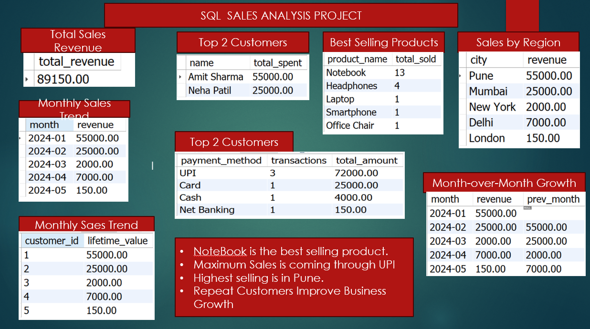

# SQL_Sales_Project
SQL Sales Analysis Project
 SQL Sales Analytics Project
Overview
This project is a Sales Analytics Database System built using MySQL.
It demonstrates how real-world business data is structured, managed, and analyzed using SQL.
The project includes table creation, relationships, data insertion, and business insights using SQL queries.

________________________________________ Database Structure
The project consists of the following tables:
•	customers → Stores customer details
•	products → Stores product information
•	orders → Stores order-level data
•	order_items → Stores product details for each order
•	payments → Stores payment transactions
________________________________________ Relationships
•	One customer can place multiple orders
•	One order can have multiple products (order items)
•	Each order is linked to payment details
•	Products are linked through order items
________________________________________ Features
✔ Database design using Primary and Foreign Keys
✔ Real-world relational structure
✔ Data insertion for testing
✔ Business analysis queries
✔ Sales and customer insights
________________________________________
Business Insights Covered
•	Total sales calculation
•	Top customers analysis
•	Product performance analysis
•	Payment method trends
•	Order-level revenue tracking
________________________________________ Technologies Used
•	MySQL Workbench
•	SQL (DDL, DML, DQL)
•	Relational Database Design
________________________________________
 Key Learning Outcomes
•	Database design fundamentals
•	Relationship modeling (1-to-Many)
•	Writing complex SQL queries
•	Data analysis using SQL
•	Structuring real-world projects
________________________________________
